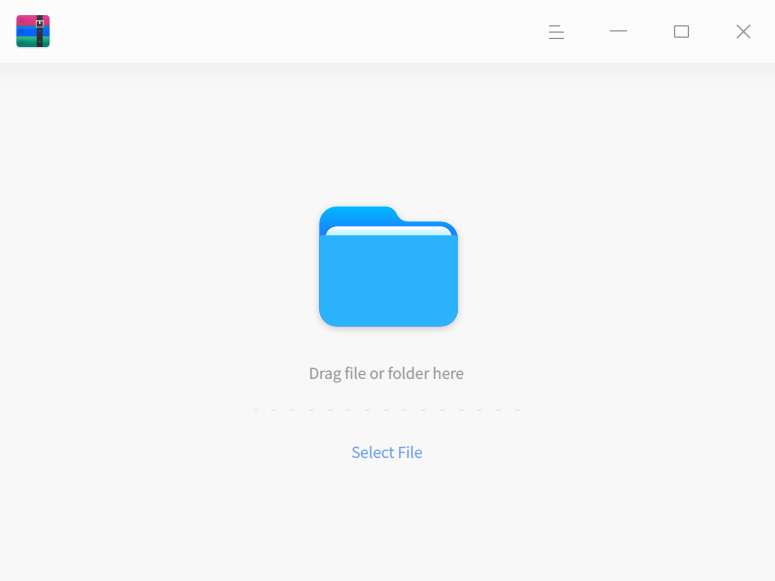
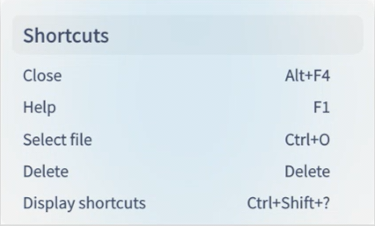
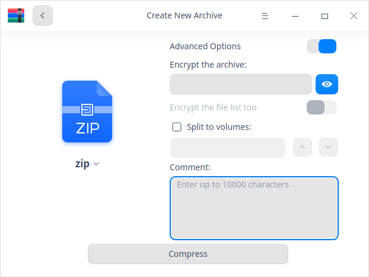
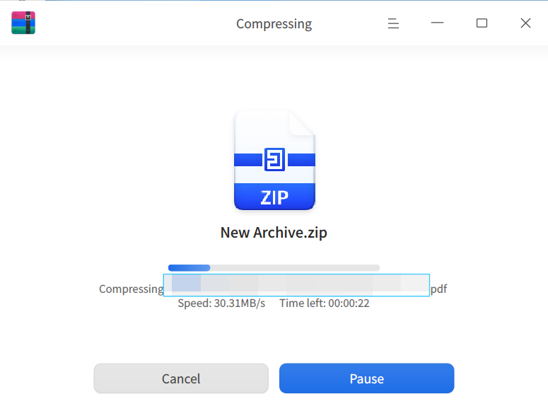

<!--
SPDX-FileCopyrightText: 2022 UnionTech Software Technology Co., Ltd.

SPDX-License-Identifier: GPL-3.0-or-later
-->

# Archive Manager|deepin-compressor|

## Overview

Archive Manager is a user-friendly and easy-to-use compressing and decompressing software, supporting multiple compressing formats such as 7z, jar, tar, tar.bz2, tar.gz, tar.lz, tar.lzma, tar.lzo, tar.xz, tar.Z, tar.7z, zip and so on as well as encrypted compressing with multiple passwords, volume compressing, adding comments, etc.

## Guide

You can run, exit or create a shortcut for Archive Manager by the following ways.

### Run Archive Manager

1.  Click  on dock  to enter the Launcher interface.
2.  Locate  by scrolling the mouse wheel or searching Archive Manager in the Launcher interface and click it to run.
3.  Right-click  and you can:
 - Click **Send to desktop** to create a desktop shortcut.
 - Click **Send to dock** to fix it on Dock.
 - Click **Add to startup** to add it to startup and it will auto run when the system boots.

### Exit Archive Manager

- Click  on the Archive Manager interface to exit Archive Manager.
- Right-click  on dock and select **Close All** to exit.
- Click  on the Archive Manager interface and select  **Exit** to exit.

### View Shortcuts

On the Archive Manager interface, press **Ctrl+ Shift+?** on the keyboard to view shortcuts. Proficiency in shortcuts will greatly improve your efficiency.

## Operations

In the interface of archive manager, single or multiple files (folders) can be compressed or decompressed, and multiple windows can be operated at the same time.

### Compress

1. To select files to be compressed:
   + right-click the files (folder) to be compressed and select **Compress**.
   + drag the files (folder) directly to the Archive Manager interface and click **Next**.
      - Click  or  > **Open File** to add more files (folder) to be compressed.
      - In the list of files, right-click a file (folder) to view or delete it. 

   

2. Set the name, storage location, compression method, etc.
   
   >  Notes: the default format of compressed packages is .zip. 

   

   

<table border="1">
   <tr>
    <th>Option</th>
 <th>Description </th>
</tr>
   <tr>
    <td>Compression method</td>
    <td>Options include: Store, Fastest, Fast, Normal, Good, Best.
      <ul>
          <li>Store: click this button to package the files instead of to compress them.</li>
          <li> Fastest, Fast, Normal, Good, Best: these buttons are ranked in ascending order by  compression rate. The higher the compression rate, the longer it takes to compress the same file.</li>
      </ul>
 </td>
</tr>
   <tr>
    <td>Advanced Options</td>
    <td>Switch on "Advanced Options", then you can encrypt files/ file lists, split to volumes, and add comments.
    <ul>
          <li>CPU threads: You can choose among single thread, 2 threads, 4 threads or 8 threads for compression (for tar.gz format only). The more CPU threads, the higher the compression efficiency.</li>
          <li>Encrypt the archive: You can encrypt archives. After that, you will have to enter password to view the file contents. Formats such as 7z, tar.7z and zip are supported. You can use numbers, letters, symbols or common Chinese characters to encrypt archives.</li>
          <li>Encrypt the file list too: you can encrypt file list. After that, you will have to enter password to view the file list contents. Formats such as 7z and tar.7z are supported. The password used here is the same as the one you use for archive encryption. </li>
          <li>Split to volumes: This option is applicable for large files, which splits the large file into several volumes and is convenient for transferring. At most 200 volumes are supported. Formats such as 7z and zip are supported.</li>
          <li>Comments: You can only add comments to package in zip format.</li>
      </ul>
 </td>
   </tr>
   </table>

3.  Click **Compress**. You can pause/continue compression during the compressing process.

   

4.  After compression is successfully finished, you can:

   - Click **View** to view the specific storage location.
   - Click **Back** to return to the main interface after successful compression.
   
   

### Decompression

1.  Select a package, and then:
   + right-click and select **Extract**.
   + drag the package directly to the Archive Manager interface.
      - Add and encrypt files: click  or  > **Open File** to add more files to the package. In the pop-up dialog box, you can select **Use password** and set a password. Different passwords can be added to different files. This option is only applicable for packages in zip format.
      
      
      
      - View: click  to view detail information and comments. Re-editing comments is only applicable for packages in zip format.
2.  In the decompression interface, you can set path, file extraction, etc.
   - set storing path: Click **Extract to:  /home/xxx/Desktop**  to customize the extraction path.
   - extract files: in the file list, right-click a file(folder) and select **Extract** or **Extract to current directory** to extract the file to the corresponding path.
   - view or delete files: in the file list, right-click a file(folder) and select **Open** to view it, or select **Delete** to remove it from the list.

   
   
3.  Click **Extract**. During extraction, you can pause/continue extraction.

   >  Notes: When there is one encrypted file in the package, you will have to enter the password to extract.  file to be extracted is encrypted, you need to enter the password to complete extraction. When there are multiple encrypted files in the package, you will have to enter the passwords correspondingly. 

4.  After decompression is successfully done, you can:
   - Click **View** to view the specific storage location.
   - Click **Back** to return to the main interface.

   

  

## Main Menu

In the main menu, you can open the compression interface, switch window themes, view the help manual and get more information about Archive Manager.

### Open file
1. Click  on the Archive Manager interface.
2. Select **Open file** and select the file to be compressed or extracted from the file selector.

### Settings

1. Click  on the Archive Manager interface.
2. Click **Settings**.
   - Extraction:
      + Set the directory where the extracted archives go to;
      + Check or uncheck **Auto create a folder for multiple extracted files**;
      + Check or uncheck **Show extracted files when completed**.
   - File Management:
      + Set whether to **Delete archives after extraction**, you have options such as **Never**, **Ask for confirmation** and **Always**.
      + Check or uncheck **Delete files after compression**.
   - Files Associated:
      + Check or uncheck file types of associated files.
3. Click **Restore Defaults** on the interface to restore the initial setting.

### Theme

The window theme includes Light Theme, Dark Theme and System Theme.

1. On the Archive Manager interface, click .
2. Click **Theme** to select a theme.

### Help

View Help to get more information about Archive Manager.

1. On the Archive Manager interface, click .
2. Click **Help**.
3. View the manual.

### About

1. On the Archive Manager interface, click . 
2. Click **About**.
3. View the version description.

### Exit

1. On the Archive Manager interface, click .
2. Click **Exit** to exit.
