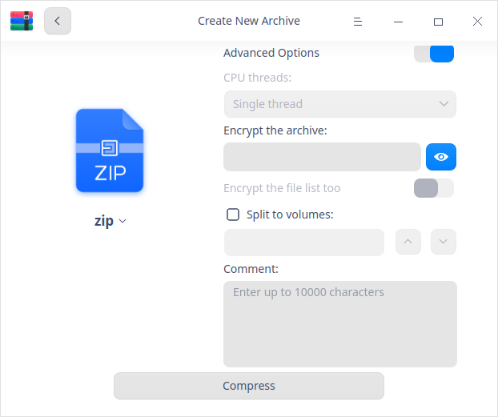

# Archive Manager|../common/deepin_compressor_96.svg|

## Overview

Archive Manager is a user-friendly and easy-to-use compressing and decompressing software, supporting multiple compressing formats such as 7z, jar, tar, tar.bz2, tar.gz, tar.lz, tar.lzma, tar.lzo, tar.xz, tar.Z, tar.7z, zip and so on as well as encrypted compressing settings.

## Guide

You can run, exit or create a shortcut for Archive Manager by the following ways.

### Run Archive Manager

1.  Click  on dock  to enter the Launcher interface.
2.  Locate  by scrolling the mouse wheel or searching Archive Manager in the Launcher interface and click it to run.
3.  Right-click  and you can:
 - Click **Send to desktop** to create a desktop shortcut.
 - Click **Send to dock** to fix it on Dock.
 - Click **Add to startup** to add it to startup and it will auto run when the system boots.

> Tips: You can set Archive Manager in the control center as the default compression and decompression viewer. Please refer to [Default Applications](dman:///dde#Default Application Settings) for details.

### Exit Archive Manager

- Click   on the Archive Manager interface to exit Archive Manager.
- Right-click on dock and select **Close All** to exit.
- Click  on the Archive Manager interface and select  **Exit** to exit.

### View Shortcuts

On the Archive Manager interface, press **Ctrl+ Shift+?** on the keyboard to view shortcuts. Proficiency in shortcuts will greatly improve your efficiency.

## Operations

### Compress

It is available for you to compress a single file/folder/package or a collection of multiple files/folders/packages.

1. On the Archive Manager interface, click **Select File** to select the file to be compressed and click **Open**.

   > Tips: You can drag one or more files directly to the Archive Manager interface.
   
2.  Click   or click   > **Open file** to add more files to be compressed.

   

3.  Click **Next**.

4.  Set the name, storage location, compression method, etc.
   
   > Notes: under **Compression method**, you can select **Store** (which means to package the files instead of to compress them), **Fastest**,  **Fast**, **Normal**, **Good**, **Best**(these buttons are ranked in ascending order by  compression rate. The higher the compression rate, the longer it takes to compress the same file.)

5.  If you enable the advanced option mode, it is available for you to set file encryption, list encryption, volume compression or add comments.
   > Notes: 
      + The default package is in .zip format.
      + The available formats for file encryption are .7z and .zip.
      + The available format for list encryption is .7z; the file encryption password is the same as the one for list encryption.
      + The available format for volume compression is .7z. 
      + The available format for comments is .zip.
   

6.  Click **Compress**.

7.  After compression is successfully finished, you can:

   - Click **View** to view the specific storage location.
   - Click **Back** to return to the main interface after successful compression.
   
   > Tips: You can also right-click and select **Compress** to compress the file.
   
   

### Decompression

1.  On the Archive Manager interface, click **Select File** to select the file to be decompressed and click **Open**.
2.  In the decompression interface, you can :
   - Click  on the tool bar to view the detailed info and comments, or re-edit the comments.
   - Click **Extract to:  /home/xxx/Desktop**  to customize the extraction path.

   >Notes: "xxx" refers to your username of the system.

3.  Click **Extract** to extract the files to the default path.

   > Notes: When the file to be extracted is encrypted, you need to enter the password to complete extraction.

4.  After decompression is successfully done, you can:
   - Click **View** to view the specific storage location.
   - Click **Back** to return to the main interface.

   > Tips: You can also right-click a package and select **Extract** to decompress the file.

  

### Extract Files

On the Archive Manager interface, select a file to be extracted, right-click and select **Extract** or **Extract to  current directory** to extract the files to the corresponding directory. 

> Notes: When the file to be extracted is encrypted, you need to enter the password to open and extract the files. 

   

## Main Menu

In the main menu, you can open the compression interface, switch window themes, view the help manual and get more information about Archive Manager.

### Open file
1.  Click   on the Archive Manager interface.
2.  Select **Open file** and select the file to be compressed or extracted from the file selector.

### Settings

1.  Click   on the Archive Manager interface.
2.  Click **Settings**.
   - Extraction:
      + Set the directory where the extracted archives go to;
      + Check or uncheck **Auto create a folder for multiple extracted files**;
      + Check or uncheck **Show extracted files when completed**.
   - File Management:
      + Set whether to **Delete archives after extraction**, you have options such as **Never**, **Ask for confirmation** and **Always**.
      + Check or uncheck **Delete files after compression**.
   - Files Associated:
      + Check or uncheck file types of associated files.
3.  Click **Restore Defaults** on the interface to restore the initial setting.

### Theme

The window theme includes Light Theme, Dark Theme and System Theme.

1.   On the Archive Manager interface, click.
2.   Click **Theme** to select a theme.

### Help

View Help to get more information about Archive Manager.

1.  On the Archive Manager interface, click .
2.  Click **Help**.
3.  View the manual.

### About

1.   On the Archive Manager interface, click  . 
2.  Click **About**.
3.   View the version description.

### Exit

1.  On the Archive Manager interface, click  .
2.  Click **Exit** to exit.
