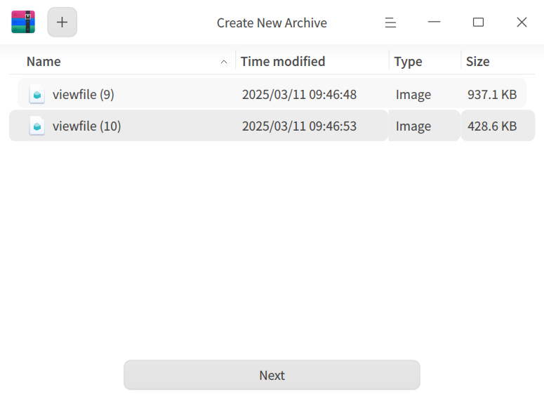

# Archive Manager | deepin-compressor|

## Overview

Archive Manager is a user-friendly compression and decompression software that supports various archive formats including 7z, jar, tar, tar.bz2, tar.gz, tar.lz, tar.lzma, tar.lzo, tar.xz, tar.Z, tar.7z, and zip. It also supports multi-password encryption, split-volume compression, and adding comments.

## Getting Started

Learn how to launch, close, or create shortcuts for Archive Manager.

### Launching Archive Manager

1. Click the Launcher icon  on the taskbar to enter the Launcher interface.
2. Scroll the mouse wheel or search to find the Archive Manager icon , then click to launch.
3. Right-click  to:
   - Click **Send to Desktop** to create a desktop shortcut.
   - Click **Send to Taskbar** to pin the application to the taskbar.
   - Click **Start on Boot** to add the application to startup items, so it runs automatically when the computer starts.

### Closing Archive Manager

- In the Archive Manager interface, click  to exit Archive Manager.
- Right-click the taskbar icon  and select **Close All** to exit Archive Manager.
- In the Archive Manager interface, click  and select **Exit** to exit Archive Manager.

### Viewing Shortcuts

In the Archive Manager interface, use the shortcut **Ctrl + Shift + ?** to open the shortcut preview interface. Mastering shortcuts will greatly improve your operational efficiency.

## Operations Guide

In the Archive Manager interface, you can compress or decompress single or multiple files/folders, and support multiple windows operating simultaneously.

### Compression
1. Select files to compress.

   + Right-click the file/folder to be compressed and select **Compress**.
   + Drag files directly to the Archive Manager interface and click **Next**.
      - Click the Add button  in the top-left corner or  > **Open File** to continue adding files/folders to compress.
      - In the Archive Manager file list, right-click a file/folder to view or delete it.

   

2. In the compression interface, set the file name, storage path, compression method, and other information.
   >  Note: The default format for compressed files is zip.

   
   
   

<table border="1">
   <tr>
    <th>Name</th>
    <th>Description</th>
</tr>
   <tr>
    <td>Compression Method</td>
    <td>Options include Store, Fastest, Faster, Standard, Better, Best.
      <ul>
          <li>Store: Only packages files without compression.</li>
          <li>Fastest, Faster, Standard, Better, Best: Gradually increase compression ratio. Higher compression ratio requires more time to compress the same file.</li>
      </ul>
 </td>
</tr>
   <tr>
    <td>Advanced Options</td>
    <td>After enabling advanced options, you can set encryption, split-volume compression, add comments, etc. for files/file lists.
    <ul>
          <li>CPU Threads: Includes single-thread, dual-thread, quad-thread, and octa-thread. More threads mean faster compression speed. Only supported for tar.gz format.</li>
          <li>Encrypt Files: Encrypt files requiring a password to view content. Supports 7z, tar.7z, zip formats. Can use numbers, letters, symbols, or common Chinese characters for encryption.</li>
          <li>Encrypt File List: Encrypt file lists requiring a password to view list information. Supports 7z, tar.7z formats. List encryption and file encryption use the same password.</li>
          <li>Split-volume Compression: Split large files for easier transmission. Can be divided into several split-volume archives, supporting up to 200 split volumes. Supports 7z, zip formats.</li>
          <li>Comment: Add comments to archives. Only supported for zip format.</li>
      </ul>
 </td>
   </tr>
</table>

3. Click **Compress**. You can pause/resume compression during the process.

   

4. After successful compression, you can:
   - Click **View Files** to see the specific storage location of the compressed file.
   - Click **Back** to return to the main interface and select files for compression.
   
   

### Decompression

1. Select the compressed file.

   + Right-click the compressed file and select **Decompress**.
   + Drag the compressed file directly to the Archive Manager interface.
      - Add and encrypt files: Click the Add button  or  > **Open File** to add files to the compressed file. In the pop-up dialog, check "Use Password" and set a password to encrypt the file. Different files can have different passwords. Only zip format archives support encrypting appended files.
      
      

      - View information: Click the icon  on the menu bar to view file information and comment content. Only zip format archives support re-editing comments.

2. In the decompression interface, you can set paths, extract files, etc.
   - Set storage path: Click **Extract to: xxx (path)** and select the storage path in the pop-up window.
   - Extract files: In the file list, right-click a file/folder and select **Extract** or **Extract to Current Folder** to extract to the corresponding path.
   - View or delete files: In the file list, right-click a file/folder, select **Open** to view it or select **Delete** to remove it from the list.

   

3. Click **Decompress**. You can pause/resume decompression during the process.

   >  Note: When there are encrypted files in the compressed file, you need to enter the password to decompress. When there are multiple encrypted files, you need to enter passwords one by one to decompress.

4. After successful decompression, you can:
   - Click **View Files** to see the specific storage location of the decompressed files.
   - Click **Back** to return to the main interface and select compressed files for decompression.

   

## Main Menu

In the main menu, you can open files, modify settings, switch window themes, view help manuals, and learn more about Archive Manager.

### Open
1. In the Archive Manager interface, click .
2. Select **Open File** to select files to compress or compressed files.

### Settings

1. In the Archive Manager interface, click .
2. Select **Settings** to perform the following operations:
   - Decompression Settings
     + Set default decompression location: Choose current directory, desktop, or set other directory.
     + Check or uncheck **Automatically create folders**.
     + Check or uncheck **Automatically open corresponding folder after decompression**.
   - File Management Settings
     + Set whether to **Delete compressed file after decompression**: Choose "Never", "Ask for confirmation", or "Always".
     + Check or uncheck **Delete original files after compression**.
   - Associated File Settings
     + Check or uncheck associated file types. All are checked by default.
3. Click **Restore Defaults** to reset all settings to initial state.

### Theme

Window themes include Light theme, Dark theme, and System theme.

1. In the Archive Manager interface, click .
2. Select **Theme** and choose a theme color.

### Help

View the help manual to learn more about and use Archive Manager.

1. In the Archive Manager interface, click .
2. Select **Help**.
3. View Archive Manager's help manual.

### About

1. In the Archive Manager interface, click .
2. Select **About**.
3. View Archive Manager's version and introduction.

### Exit

1. In the Archive Manager interface, click .
2. Select **Exit**.