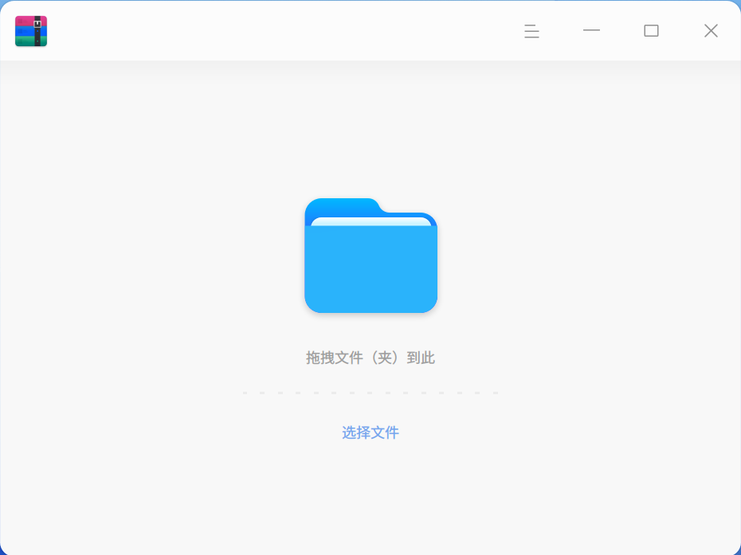
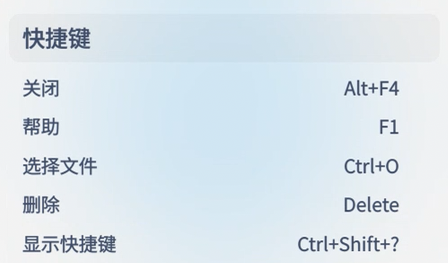
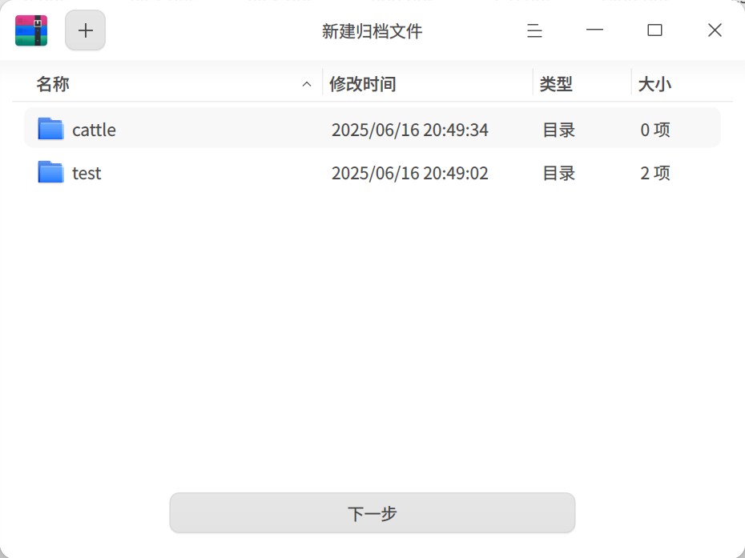
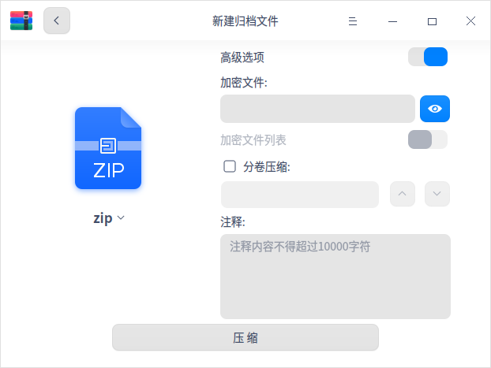
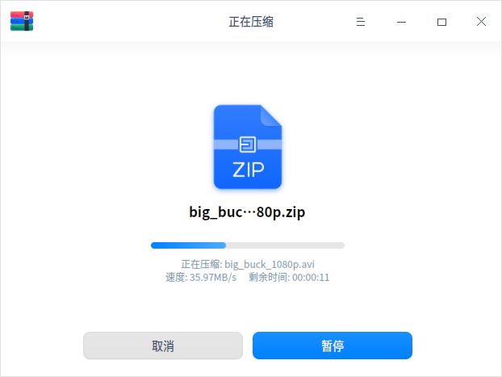
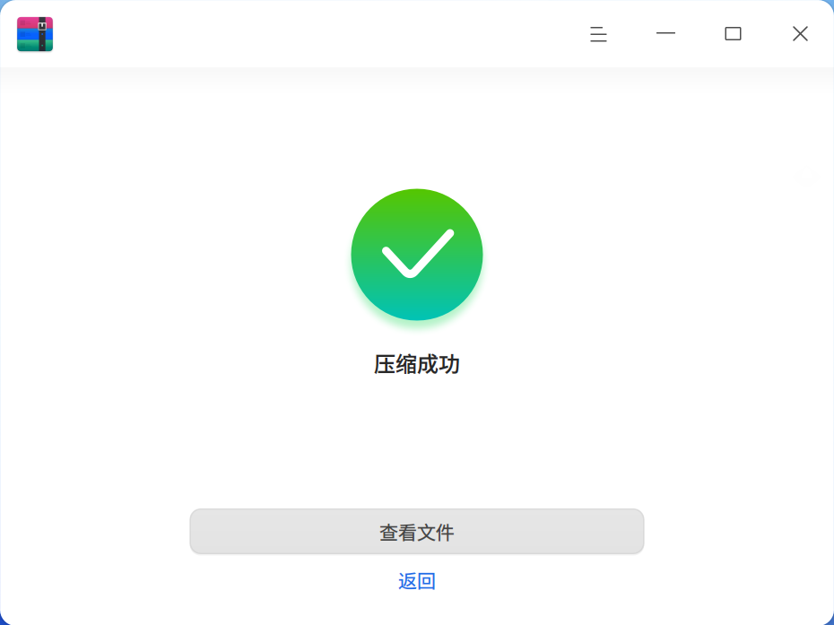
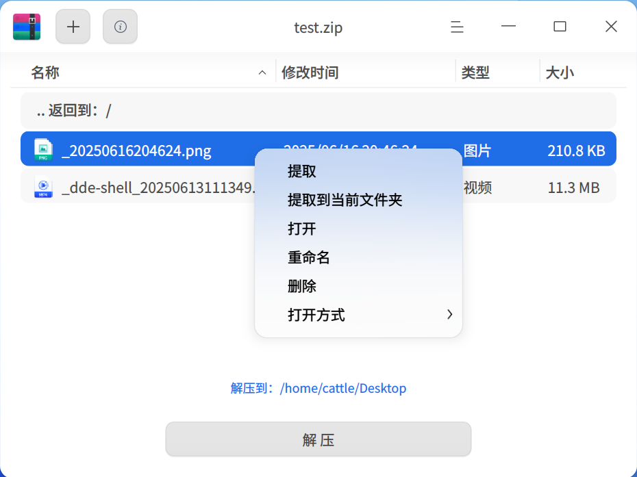
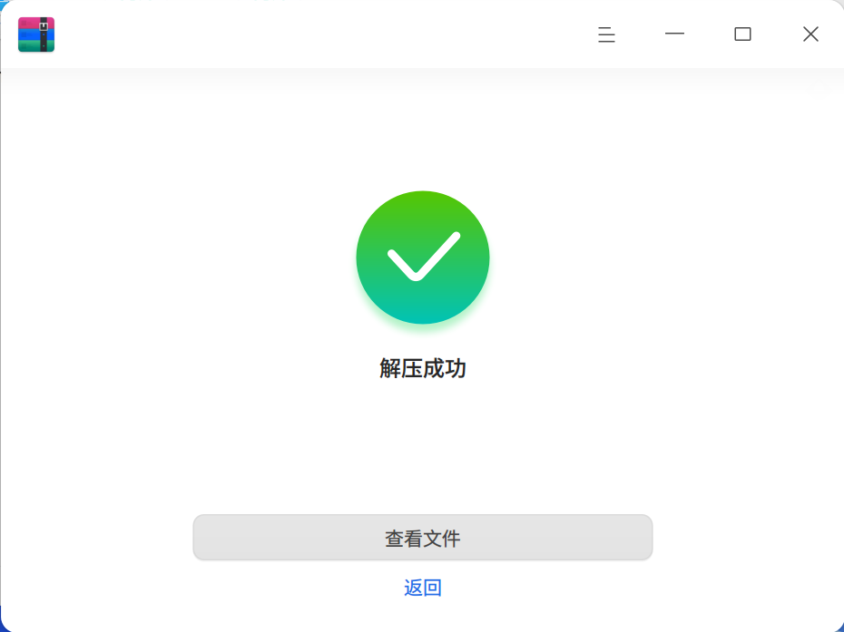

# 归档管理器|deepin-compressor|

## 概述

归档管理器是一款界面友好、使用方便的压缩与解压缩软件，支持7z、jar、tar、tar.bz2、tar.gz、tar.lz、tar.lzma、tar.lzo、tar.xz、tar.Z、tar.7z、zip等多种压缩包格式，还支持多密码压缩、分卷压缩、添加注释等功能。

## 使用入门

通过以下方式运行或关闭归档管理器，或者创建归档管理器的快捷方式。

### 运行归档管理器

1. 单击任务栏上的启动器图标 ，进入启动器界面。
2. 上下滚动鼠标滚轮浏览或通过搜索，找到归档管理器图标 ，单击运行。
3. 右键单击 ，您可以：
 - 单击 **发送到桌面**，在桌面创建快捷方式。
 - 单击 **发送到任务栏**，将应用程序固定到任务栏。
 - 单击 **开机自动启动**，将应用程序添加到开机启动项，在电脑开机时自动运行该应用。

### 关闭归档管理器

- 在归档管理器界面单击  ，退出归档管理器。
- 在任务栏右键单击 ，选择 **关闭所有** ，退出归档管理器。
- 在归档管理器界面单击 ，选择 **退出** ，退出归档管理器。

### 查看快捷键

在归档管理器界面，使用快捷键 **Ctrl + Shift + ?** 打开快捷键预览界面。熟练地使用快捷键，将大大提升您的操作效率。

## 操作介绍

在归档管理器界面，可对单个或多个文件（夹）进行压缩或解压缩，并且支持多个窗口同时操作。

### 压缩
1. 选择压缩文件。

   + 右键单击待压缩的文件（夹）选择 **压缩**。
   + 直接将文件拖拽到在归档管理器界面上，单击 **下一步**。
      - 单击左上角的添加按钮  或 > **打开文件**，可以继续添加需要压缩的文件（夹)。
      - 在归档管理器文件列表中，右键单击文件（夹）可以查看或删除文件（夹）。

   

2. 在压缩界面中设置文件名、存储路径、压缩方式等信息。
   > 说明：压缩包的默认格式为zip。

   
   
   

<table border="1">
   <tr>
    <th>名称</th>
 <th>说明 </th>
</tr>
   <tr>
    <td>压缩方式</td>
    <td>压缩方式的选项有存储、最快、较快、标准、较好、最好。
      <ul>
          <li>存储：只对文件进行打包，不做压缩处理。</li>
          <li>最快、较快、标准、较好、最好：逐渐提高压缩率，压缩率越高，压缩同一文件所需要的时间就越长。</li>
      </ul>
 </td>
</tr>
   <tr>
    <td>高级选项</td>
    <td>开启高级选项后，可以对文件/文件列表进行加密、分卷压缩、添加注释等。
    <ul>
          <li>CPU线程数：可选择单线程或多线程进行压缩，仅支持tar.gz格式。</li>
          <li>加密文件：对文件进行加密，需要输入密码才可以查看文件内容。支持7z、tar.7z、zip格式，可以使用数字、字母、符号或常用汉字进行加密。</li>
          <li>加密文件列表：对文件列表进行加密，需要输入密码才可以查看文件列表信息。支持7z、tar.7z格式，列表加密和文件加密使用同一个密码。</li>
          <li>分卷压缩：对大型文件进行分卷压缩方便传输，可以将其分成若干个分卷压缩包，最多支持200个分卷压缩包，支持7z、zip格式。</li>
          <li>注释：对压缩包添加注释，仅支持zip格式。</li>
      </ul>
 </td>
   </tr>
   </table>

3. 单击 **压缩**，在压缩过程中可以暂停/继续压缩操作。

   

4. 压缩成功之后，您可以：
   - 单击 **查看文件**，查看压缩文件的具体存放位置。
   - 单击 **返回**，返回主界面，选择文件进行压缩。
   
   

### 解压缩

1. 选择压缩包。

   + 右键单击压缩包选择 **解压缩**。
   + 直接将压缩包拖拽到在归档管理器界面上。
      - 添加并加密文件：单击左上角的添加按钮  或  > **打开文件**，可以添加文件到压缩包。在弹出的对话框中，选择勾选“使用密码”并设置密码，对文件进行加密。不同的文件可以设置不同的密码，仅zip格式的压缩包支持对追加的文件进行加密。
      
      

      - 查看信息：单击菜单栏上的图标  可以查看文件信息和注释内容，仅zip格式的压缩包支持重新编辑注释内容。

2. 在解压缩界面，可以进行路径设置、文件提取等操作。
   - 设置存储路径：单击 **解压到：xxx（路径）** ，在弹出的窗口中选择存储路径。
   - 提取文件：在文件列表中，右键单击文件（夹）选择 **提取** 或 **提取到当前文件夹**，将文件（夹）提取到相应的路径下。
   - 查看或删除文件：在文件列表中，右键单击文件（夹），选择 **打开** 来查看文件（夹）或选择 **删除** 将文件（夹）从列表中移除。

   

3. 单击 **解压**，在解压缩过程中可以暂停/继续解压操作。

   > 说明：当压缩包中有加密文件时，则需要输入密码来解压缩，当压缩包中有多个加密文件时，则需要依次输入密码来解压缩。

4. 解压缩成功之后，您可以
   - 单击 **查看文件**，查看解压文件的具体存放位置。
   - 单击 **返回**，返回主界面，选择压缩包进行解压缩。

   

## 主菜单

在主菜单中，您可以打开文件、修改设置项、切换窗口主题、查看帮助手册，了解归档管理器的更多信息。

### 打开
1. 在归档管理器界面，单击  。
2. 选择 **打开文件**，选择待压缩文件或压缩包文件。

### 设置

1. 在归档管理器界面，单击  。
2. 选择 **设置**，可以进行如下操作：
   - 解压设置
     + 设置默认解压位置，可选择当前目录、桌面或设置其他目录。
     + 勾选或取消 **自动创建文件夹**。
     + 勾选或取消 **当解压完成后自动打开对应的文件夹**。
   - 文件管理设置
     + 设置是否 **解压后删除压缩文件**，可选择“从不”、“询问确认”或“总是”。
     + 勾选或取消 **压缩后删除原来的文件**。
   - 关联文件设置
     + 勾选或取消关联文件类型，默认全部勾选。
3. 单击 **恢复默认** 按钮，将所有设置恢复到初始状态。

### 主题

窗口主题包含浅色主题、深色主题和系统主题。

1. 在归档管理器界面，单击 。
2. 选择 **主题**，选择一个主题颜色。

### 帮助

查看帮助手册，进一步了解和使用归档管理器。

1. 在归档管理器界面，单击 。
2. 选择 **帮助**。
3. 查看归档管理器的帮助手册。

### 关于

1. 在归档管理器界面，单击 。
2. 选择 **关于**。
3. 查看归档管理器的版本和介绍。

### 退出

1. 在归档管理器界面，单击 。
2. 选择 **退出**。
