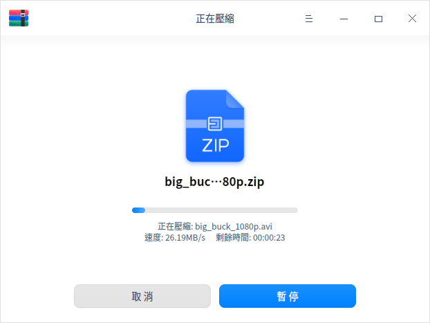
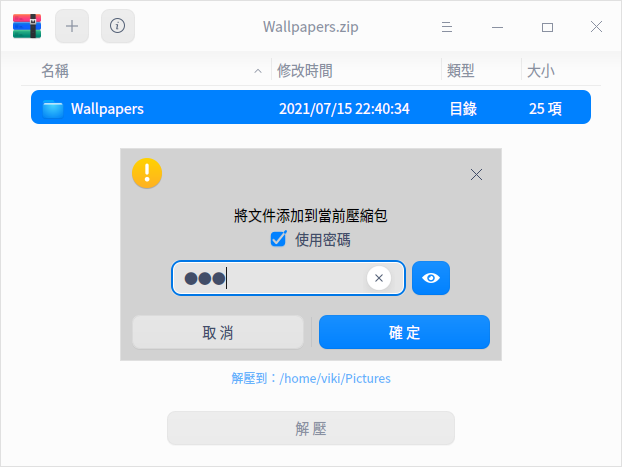

# 歸檔管理器|deepin-compressor|

## 概述

歸檔管理器是一款界面友好、使用方便的壓縮與解壓縮軟件，支持7z、jar、tar、tar.bz2、tar.gz、tar.lz、tar.lzma、tar.lzo、tar.xz、tar.Z、tar.7z、zip等多種壓縮包格式，還支持加密壓縮等設置。

## 使用入門

通過以下方式運行或關閉歸檔管理器，或者創建歸檔管理器的快捷方式。

### 運行歸檔管理器

1. 單擊任務欄上的啟動器圖標 ，進入啟動器界面。
2. 上下滾動鼠標滾輪瀏覽或通過搜索，找到歸檔管理器圖標 ，單擊運行。
3. 右鍵單擊 ，您可以：
 - 單擊 **傳送到桌面**，在桌面創建快捷方式。
 - 單擊 **傳送到任務欄**，將應用程序固定到任務欄。
 - 單擊 **加至開機啟動**，將應用程序添加到開機啟動項，在電腦開機時自動運行該應用。

### 關閉歸檔管理器

- 在歸檔管理器界面單擊 ，關閉歸檔管理器。
- 在任務欄右鍵單擊 ，選擇 **關閉所有**，關閉歸檔管理器。
- 在歸檔管理器界面單擊 ，選擇 **退出**，關閉歸檔管理器。

### 查看快捷鍵

在歸檔管理器界面，使用快捷鍵 **Ctrl + Shift + ?** 打開快捷鍵預覽界面。熟練地使用快捷鍵，將大大提升您的操作效率。

## 操作介紹

在歸檔管理器界面，可對單個或多個文件（夾）進行壓縮或解壓縮，並且支持多個窗口同時操作。

### 壓縮

1. 選擇壓縮文件。

   + 右鍵單擊待壓縮的文件（夾）選擇 **壓縮**。
   + 直接將文件拖拽到在歸檔管理器界面上，單擊 **下一步**。
      - 單擊左上角的添加按鈕  或 > **打開文件**，可以繼續添加需要壓縮的文件（夾)。
      - 在歸檔管理器文件列表中，右鍵單擊文件（夾）可以查看或刪除文件（夾）。

   

2. 在壓縮界面中設置文件名、存儲路徑、壓縮方式等訊息。
   > 說明：壓縮包的默認格式為zip。

   
   
   

<table border="1">
   <tr>
    <th>名稱</th>
 <th>說明 </th>
</tr>
   <tr>
    <td>壓縮方式</td>
    <td>壓縮方式的選項有存儲、最快、較快、標準、較好、最好。
      <ul>
          <li>存儲：只對文件進行打包，不做壓縮處理。</li>
          <li>最快、較快、標準、較好、最好：逐漸提高壓縮率，壓縮率越高，壓縮同一文件所需要的時間就越長。</li>
      </ul>
 </td>
</tr>
   <tr>
    <td>高級選項</td>
    <td>開啟高級選項後，可以對文件/文件列表進行加密、分卷壓縮、添加注釋等。
    <ul>
          <li>CPU線程數：可選擇單線程或多線程進行壓縮，僅支持tar.gz格式。</li>
          <li>加密文件：對文件進行加密，需要輸入密碼才可以查看文件內容。支持7z、tar.7z、zip格式，可以使用數字、字母、符號或常用漢字進行加密。</li>
          <li>加密文件列表：對文件列表進行加密，需要輸入密碼才可以查看文件列表訊息。支持7z、tar.7z格式，列表加密和文件加密使用同一個密碼。</li>
          <li>分卷壓縮：對大型文件進行分卷壓縮方便傳輸，可以將其分成若干個分卷壓縮包，最多支持200個分卷壓縮包，支持7z、zip格式。</li>
          <li>注釋：對壓縮包添加注釋，僅支持zip格式。</li>
      </ul>
 </td>
   </tr>
   </table>

3. 單擊 **壓縮**，在壓縮過程中可以暫停/繼續壓縮操作。

   

4. 壓縮成功之後，您可以：
   - 單擊 **查看文件**，查看壓縮文件的具體存放位置。
   - 單擊 **返回**，返回主界面，選擇文件進行壓縮。
   
   

### 解壓縮

1. 選擇壓縮包。

   + 右鍵單擊壓縮包選擇 **解壓**。
   + 直接將壓縮包拖拽到在歸檔管理器界面上。
      - 添加並加密文件：單擊左上角的添加按鈕  或  > **打開文件**，可以添加文件到壓縮包。在彈出的對話框中，選擇勾選「使用密碼」並設置密碼，對文件進行加密。不同的文件可以設置不同的密碼，僅zip格式的壓縮包支持對追加的文件進行加密。
      
      

      - 查看訊息：單擊菜單欄上的圖標  可以查看文件訊息和注釋內容，僅zip格式的壓縮包支持重新編輯注釋內容。

2. 在解壓縮界面，可以進行路徑設置、文件提取等操作。
   - 設置存儲路徑：單擊 **解壓到：xxx（路徑）** ，在彈出的窗口中選擇存儲路徑。
   - 提取文件：在文件列表中，右鍵單擊文件（夾）選擇 **提取** 或 **提取到當前文件夾**，將文件（夾）提取到相應的路徑下。
   - 查看或刪除文件：在文件列表中，右鍵單擊文件（夾），選擇 **打開** 來查看文件（夾）或選擇 **刪除** 將文件（夾）從列表中移除。

   

3. 單擊 **解壓**，在解壓縮過程中可以暫停/繼續解壓操作。

   > 說明：當壓縮包中有加密文件時，則需要輸入密碼來解壓縮，當壓縮包中有多個加密文件時，則需要依次輸入密碼來解壓縮。

4. 解壓縮成功之後，您可以
   - 單擊 **查看文件**，查看解壓文件的具體存放位置。
   - 單擊 **返回**，返回主界面，選擇壓縮包進行解壓縮。

   

## 主菜單

在主菜單中，您可以打開文件、修改設置項、切換窗口主題、查看幫助手冊，了解歸檔管理器的更多訊息。

### 打開
1. 在歸檔管理器界面，單擊 。
2. 選擇 **打開文件**，選擇待壓縮文件或壓縮包文件。

### 設置

1. 在歸檔管理器界面，單擊 。
2. 選擇 **設置**，可進行如下操作：
   - 解壓設置
     + 設置默認解壓位置，可選擇當前目錄、桌面或設置其他目錄。
     + 勾選或取消 **自動創建文件夾**。
     + 勾選或取消 **當解壓完成後自動打開對應的文件夾**。
   - 文件管理設置
     + 設置是否 **解壓後刪除壓縮文件**，可選擇“從不”、“詢問確認”或“總是”。
     + 勾選或取消 **壓縮後刪除原來的文件**。
   - 關聯文件設置
     + 勾選或取消關聯文件類型，默認全部勾選。
3. 單擊 **恢復默認** 按鈕，將所有設置恢復到初始狀態。

### 主題

窗口主題包含淺色主題、深色主題和系統主題。

1. 在歸檔管理器界面，單擊 。
2. 單擊 **主題**，選擇一個主題顏色。

### 幫助

查看幫助手冊，進一步了解和使用歸檔管理器。

1. 在歸檔管理器界面，單擊 。
2. 單擊 **幫助**。
3. 查看歸檔管理器的幫助手冊。

### 關於

1. 在歸檔管理器界面，單擊 。
2. 單擊 **關於**。
3. 查看歸檔管理器的版本和介紹。

### 退出

1. 在歸檔管理器界面，單擊 。
2. 單擊 **退出**。
