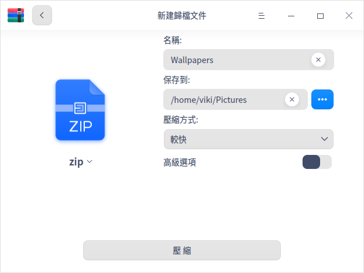
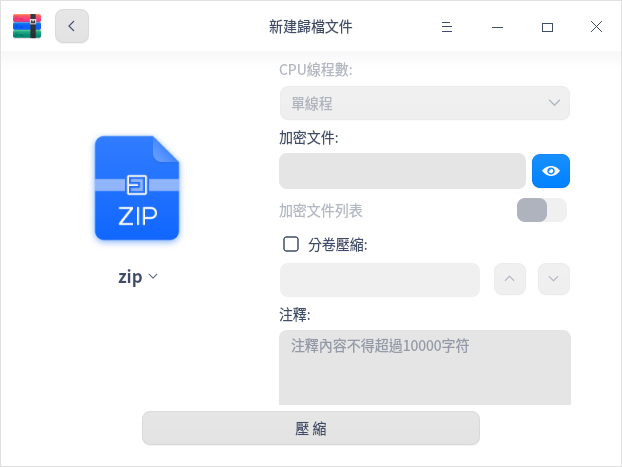
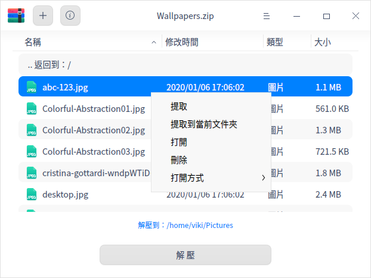

# 歸檔管理器 | deepin-compressor|

## 概述

歸檔管理器是一款界面友好、使用方便的壓縮與解壓縮軟件，支援7z、jar、tar、tar.bz2、tar.gz、tar.lz、tar.lzma、tar.lzo、tar.xz、tar.Z、tar.7z、zip等多種壓縮包格式，還支援多密碼壓縮、分卷壓縮、添加註釋等功能。

## 使用入門

透過以下方式執行或關閉歸檔管理器，或者建立歸檔管理器的捷徑。

### 執行歸檔管理器

1. 點擊工作列上的啟動器圖示 ，進入啟動器介面。
2. 上下滾動滑鼠滾輪瀏覽或透過搜尋，找到歸檔管理器圖示 ，點擊執行。
3. 右鍵點擊 ，您可以：
   - 點擊 **傳送到桌面**，在桌面建立捷徑。
   - 點擊 **傳送到工作列**，將應用程式固定到工作列。
   - 點擊 **開機自動啟動**，將應用程式添加到開機啟動項，在電腦開機時自動執行該應用程式。

### 關閉歸檔管理器

- 在歸檔管理器介面點擊 ，退出歸檔管理器。
- 在工作列右鍵點擊 ，選擇 **關閉所有**，退出歸檔管理器。
- 在歸檔管理器介面點擊 ，選擇 **退出**，退出歸檔管理器。

### 查看快速鍵

在歸檔管理器介面，使用快速鍵 **Ctrl + Shift + ?** 打開快速鍵預覽介面。熟練地使用快速鍵，將大大提升您的操作效率。

## 操作介紹

在歸檔管理器介面，可對單個或多個檔案（夾）進行壓縮或解壓縮，並且支援多個視窗同時操作。

### 壓縮
1. 選擇壓縮檔案。

   + 右鍵點擊待壓縮的檔案（夾）選擇 **壓縮**。
   + 直接將檔案拖拽到在歸檔管理器介面上，點擊 **下一步**。
      - 點擊左上角的添加按鈕  或  > **打開檔案**，可以繼續添加需要壓縮的檔案（夾）。
      - 在歸檔管理器檔案列表中，右鍵點擊檔案（夾）可以查看或刪除檔案（夾）。

   

2. 在壓縮介面中設定檔案名稱、儲存路徑、壓縮方式等資訊。
   >  說明：壓縮包的預設格式為zip。

   
   
   

<table border="1">
   <tr>
    <th>名稱</th>
    <th>說明</th>
</tr>
   <tr>
    <td>壓縮方式</td>
    <td>壓縮方式的選項有儲存、最快、較快、標準、較好、最好。
      <ul>
          <li>儲存：只對檔案進行打包，不做壓縮處理。</li>
          <li>最快、較快、標準、較好、最好：逐漸提高壓縮率，壓縮率越高，壓縮同一檔案所需要的時間就越長。</li>
      </ul>
 </td>
</tr>
   <tr>
    <td>進階選項</td>
    <td>開啟進階選項後，可以對檔案/檔案列表設定加密、分卷壓縮、添加註釋等。
    <ul>
          <li>CPU執行緒數：包括單執行緒、雙執行緒、四執行緒和八執行緒，執行緒數越多，壓縮速度越快。僅支援tar.gz格式。</li>
          <li>加密檔案：對檔案進行加密，需要輸入密碼才可以查看檔案內容。支援7z、tar.7z、zip格式，可以使用數字、字母、符號或常用漢字進行加密。</li>
          <li>加密檔案列表：對檔案列表進行加密，需要輸入密碼才可以查看檔案列表資訊。支援7z、tar.7z格式，列表加密和檔案加密使用同一個密碼。</li>
          <li>分卷壓縮：對大型檔案進行分卷壓縮方便傳輸，可以將其分成若干個分卷壓縮包，最多支援200個分卷壓縮包，支援7z、zip格式。</li>
          <li>註釋：對壓縮包添加註釋，僅支援zip格式。</li>
      </ul>
 </td>
   </tr>
</table>

3. 點擊 **壓縮**，在壓縮過程中可以暫停/繼續壓縮操作。

   

4. 壓縮成功之後，您可以：
   - 點擊 **查看檔案**，查看壓縮檔案的具體存放位置。
   - 點擊 **返回**，返回主介面，選擇檔案進行壓縮。
   
   

### 解壓縮

1. 選擇壓縮包。

   + 右鍵點擊壓縮包選擇 **解壓縮**。
   + 直接將壓縮包拖拽到在歸檔管理器介面上。
      - 添加並加密檔案：點擊左上角的添加按鈕  或  > **打開檔案**，可以添加檔案到壓縮包。在彈出的對話框中，選擇勾選「使用密碼」並設定密碼，對檔案進行加密。不同的檔案可以設定不同的密碼，僅zip格式的壓縮包支援對追加的檔案進行加密。
      
      

      - 查看資訊：點擊選單欄上的圖示  可以查看檔案資訊和註釋內容，僅zip格式的壓縮包支援重新編輯註釋內容。

2. 在解壓縮介面，可以進行路徑設定、檔案提取等操作。
   - 設定儲存路徑：點擊 **解壓到：xxx（路徑）**，在彈出的視窗中選擇儲存路徑。
   - 提取檔案：在檔案列表中，右鍵點擊檔案（夾）選擇 **提取** 或 **提取到當前資料夾**，將檔案（夾）提取到相應的路徑下。
   - 查看或刪除檔案：在檔案列表中，右鍵點擊檔案（夾），選擇 **打開** 來查看檔案（夾）或選擇 **刪除** 將檔案（夾）從列表中移除。

   

3. 點擊 **解壓**，在解壓縮過程中可以暫停/繼續解壓操作。

   >  說明：當壓縮包中有加密檔案時，則需要輸入密碼來解壓縮，當壓縮包中有多個加密檔案時，則需要依次輸入密碼來解壓縮。

4. 解壓縮成功之後，您可以：
   - 點擊 **查看檔案**，查看解壓檔案的具體存放位置。
   - 點擊 **返回**，返回主介面，選擇壓縮包進行解壓縮。

   

## 主選單

在主選單中，您可以打開檔案、修改設定項、切換視窗主題、查看說明手冊，了解歸檔管理器的更多資訊。

### 打開
1. 在歸檔管理器介面，點擊 。
2. 選擇 **打開檔案**，選擇待壓縮檔案或壓縮包檔案。

### 設定

1. 在歸檔管理器介面，點擊 。
2. 選擇 **設定**，可以進行如下操作：
   - 解壓設定
     + 設定預設解壓位置，可選擇當前目錄、桌面或設定其他目錄。
     + 勾選或取消 **自動建立資料夾**。
     + 勾選或取消 **當解壓完成後自動打開對應的資料夾**。
   - 檔案管理設定
     + 設定是否 **解壓後刪除壓縮檔案**，可選擇「從不」、「詢問確認」或「總是」。
     + 勾選或取消 **壓縮後刪除原來的檔案**。
   - 關聯檔案設定
     + 勾選或取消關聯檔案類型，預設全部勾選。
3. 點擊 **恢復預設** 按鈕，將所有設定恢復到初始狀態。

### 主題

視窗主題包含淺色主題、深色主題和系統主題。

1. 在歸檔管理器介面，點擊 。
2. 選擇 **主題**，選擇一個主題顏色。

### 說明

查看說明手冊，進一步了解和使用歸檔管理器。

1. 在歸檔管理器介面，點擊 。
2. 選擇 **說明**。
3. 查看歸檔管理器的說明手冊。

### 關於

1. 在歸檔管理器介面，點擊 。
2. 選擇 **關於**。
3. 查看歸檔管理器的版本和介紹。

### 退出

1. 在歸檔管理器介面，點擊 。
2. 選擇 **退出**。