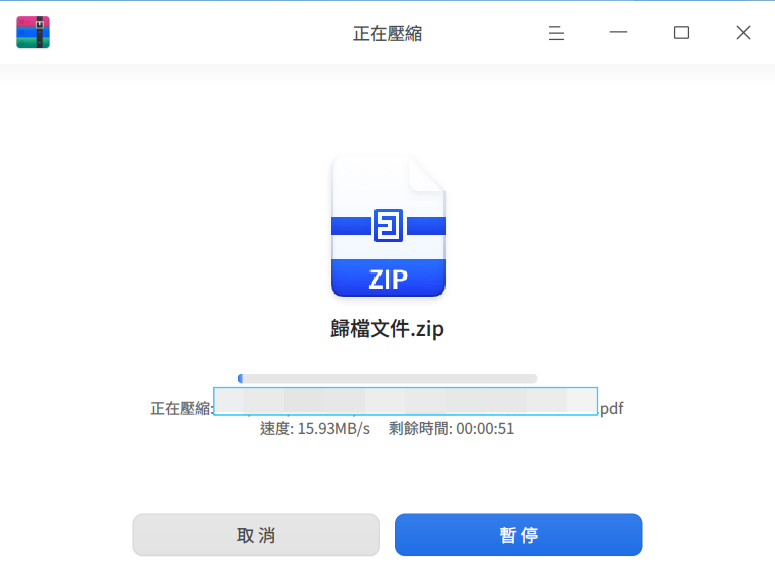
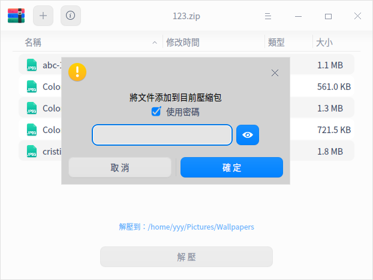
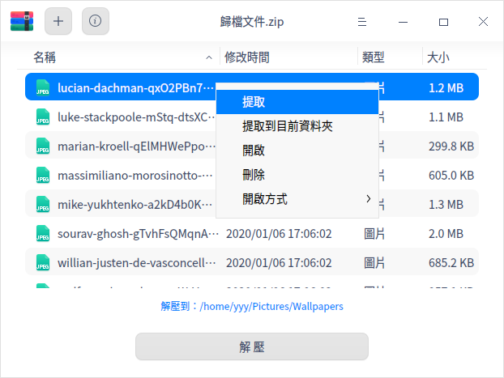

# 壓縮管理員 | deepin-compressor|

## 概述

壓縮管理員是一款操作簡便的壓縮與解壓縮工具，支援7z、jar、tar、tar.bz2、tar.gz、tar.lz、tar.lzma、tar.lzo、tar.xz、tar.Z、tar.7z、zip等格式，並提供多重密碼加密、分割壓縮、加入註解等功能。

## 使用入門

了解如何啟動、關閉或建立壓縮管理員的捷徑。

### 啟動壓縮管理員

1. 點選工作列上的啟動器圖示 ，進入啟動器介面。
2. 滾動滑鼠滾輪或搜尋找到壓縮管理員圖示 ，點選啟動。
3. 右鍵點選  可：
   - 點選 **傳送到桌面**，在桌面建立捷徑。
   - 點選 **傳送到工作列**，將應用程式釘選到工作列。
   - 點選 **開機自動啟動**，將應用程式加入開機啟動項目，電腦開機時自動執行。

### 關閉壓縮管理員

- 在壓縮管理員介面點選 ，關閉壓縮管理員。
- 在工作列右鍵點選 ，選擇 **關閉所有** 來關閉壓縮管理員。
- 在壓縮管理員介面點選 ，選擇 **結束** 來關閉壓縮管理員。

### 檢視快速鍵

在壓縮管理員介面，使用快速鍵 **Ctrl + Shift + ?** 開啟快速鍵預覽介面。熟練使用快速鍵可提升操作效率。

## 操作說明

在壓縮管理員介面，可對單一或多個檔案(資料夾)進行壓縮/解壓縮，並支援多視窗同時操作。

### 壓縮
1. 選擇壓縮檔案。

   + 右鍵點選待壓縮的檔案(夾)選擇 **壓縮**。
   + 直接將檔案拖曳到壓縮管理員介面，點選 **下一步**。
      - 點選左上角的添加按鈕  或  > **開啟檔案**，可繼續添加需壓縮的檔案(夾)。
      - 在壓縮管理員檔案清單中，右鍵點選檔案(夾)可預覽或刪除。

   

2. 在壓縮介面設定檔案名稱、儲存路徑、壓縮方式等資訊。
   >  說明：壓縮檔預設格式為zip。

   
   
   

<table border="1">
   <tr>
    <th>名稱</th>
    <th>說明</th>
</tr>
   <tr>
    <td>壓縮方式</td>
    <td>選項包含儲存、最快、較快、標準、較好、最佳。
      <ul>
          <li>儲存：僅封裝檔案不壓縮。</li>
          <li>最快、較快、標準、較好、最佳：壓縮率越高，處理時間越長。</li>
      </ul>
 </td>
</tr>
   <tr>
    <td>進階設定</td>
    <td>啟用進階設定後，可設定加密、分割壓縮、註解等。
    <ul>
          <li>CPU執行緒數：單/雙/四/八執行緒，執行緒越多壓縮越快。僅支援tar.gz格式。</li>
          <li>加密檔案：需輸入密碼才能檢視內容。支援7z、tar.7z、zip格式，可用數字、字母、符號或常用漢字加密。</li>
          <li>加密檔案清單：需輸入密碼才能檢視清單資訊。支援7z、tar.7z格式，清單與檔案加密使用相同密碼。</li>
          <li>分割壓縮：將大檔案分割方便傳輸，最多支援200個分割檔。支援7z、zip格式。</li>
          <li>註解：為壓縮檔添加註解。僅支援zip格式。</li>
      </ul>
 </td>
   </tr>
</table>

3. 點選 **壓縮**，過程中可暫停/繼續。

   

4. 壓縮成功後，您可以：
   - 點選 **檢視檔案**，查看壓縮檔儲存位置。
   - 點選 **返回**，回到主畫面選擇檔案壓縮。
   
   

### 解壓縮

1. 選擇壓縮檔。

   + 右鍵點選壓縮檔選擇 **解壓縮**。
   + 直接將壓縮檔拖曳到壓縮管理員介面。
      - 添加並加密檔案：點選添加按鈕  或  > **開啟檔案**。在彈出視窗勾選「使用密碼」並設定密碼加密。不同檔案可設不同密碼，僅zip格式支援追加檔案加密。
      
      

      - 檢視資訊：點選選單列圖示  檢視檔案資訊與註解。僅zip格式支援重新編輯註解。

2. 在解壓縮介面，可設定路徑、提取檔案等操作。
   - 設定儲存路徑：點選 **解壓到：xxx（路徑）**，選擇儲存位置。
   - 提取檔案：在檔案清單中，右鍵點選檔案(夾)選擇 **提取** 或 **提取到當前資料夾**。
   - 檢視或刪除：在檔案清單中，右鍵點選檔案(夾)選擇 **開啟** 檢視或 **刪除** 移除。

   

3. 點選 **解壓**，過程中可暫停/繼續。

   >  說明：壓縮檔含加密檔案時需輸入密碼解壓，多個加密檔案需依序輸入密碼。

4. 解壓縮成功後，您可以：
   - 點選 **檢視檔案**，查看解壓檔案位置。
   - 點選 **返回**，回到主畫面選擇壓縮檔解壓。
   
   

## 主選單

在主選單中，可開啟檔案、修改設定、切換主題、檢視說明，了解更多壓縮管理員功能。

### 開啟
1. 在壓縮管理員介面，點選 。
2. 選擇 **開啟檔案**，選擇待壓縮檔案或壓縮檔。

### 設定

1. 在壓縮管理員介面，點選 。
2. 選擇 **設定**，可進行以下設定：
   - 解壓縮設定
     + 設定預設解壓位置：目前目錄、桌面或自訂路徑。
     + 勾選或取消 **自動建立資料夾**。
     + 勾選或取消 **解壓完成後自動開啟對應資料夾**。
   - 檔案管理設定
     + 設定 **解壓後刪除壓縮檔**：永不、詢問確認或總是。
     + 勾選或取消 **壓縮後刪除原始檔案**。
   - 關聯檔案設定
     + 勾選或取消關聯檔案類型，預設全選。
3. 點選 **恢復預設值**，重設所有設定。

### 主題

視窗主題包含淺色、深色及系統主題。

1. 在壓縮管理員介面，點選 。
2. 選擇 **主題**，選擇主題色彩。

### 說明

檢視使用手冊，深入了解壓縮管理員。

1. 在壓縮管理員介面，點選 。
2. 選擇 **說明**。
3. 檢視壓縮管理員的使用手冊。

### 關於

1. 在壓縮管理員介面，點選 。
2. 選擇 **關於**。
3. 檢視壓縮管理員的版本資訊與介紹。

### 結束

1. 在壓縮管理員介面，點選 。
2. 選擇 **結束**。