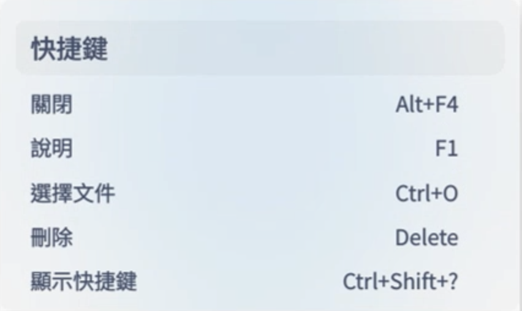
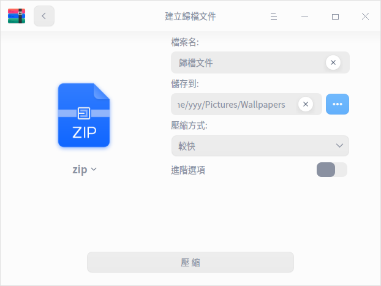
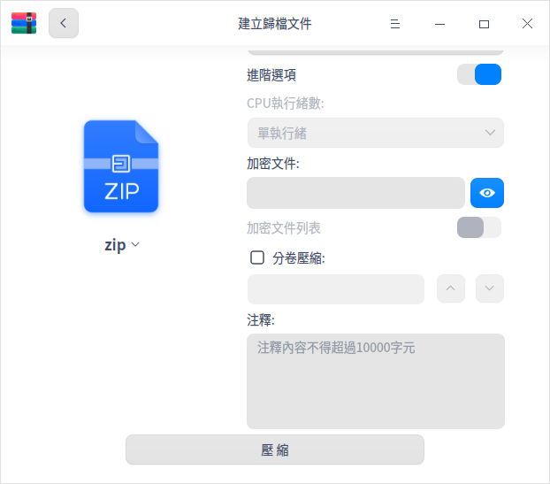

<!--
SPDX-FileCopyrightText: 2022 UnionTech Software Technology Co., Ltd.

SPDX-License-Identifier: GPL-3.0-or-later
-->

# 歸檔管理器|deepin-compressor|

## 概述

歸檔管理器是一款介面友好、使用方便的壓縮與解壓縮軟體，支援7z、jar、tar、tar.bz2、tar.gz、tar.lz、tar.lzma、tar.lzo、tar.Z、zip等多種壓縮包格式，還支援多密碼壓縮、分卷壓縮、添加注釋等功能。

## 使用入門

透過以下方式執行或關閉歸檔管理器，或者建立歸檔管理器的捷徑。

### 執行歸檔管理器

1. 單擊任務欄上的啟動器圖示 ，進入啟動器介面。
2. 上下滾動滑鼠滾輪瀏覽或透過搜尋，找到歸檔管理器圖示 ，單擊執行。
3. 右鍵單擊 ，您可以：
 - 單擊 **建立桌面捷徑**，在桌面建立捷徑。
 - 單擊 **釘選到Dock**，將應用程式固定到Dock。
 - 單擊 **開機啟動**，將應用程式添加到開機啟動項，在電腦開機時自動執行該應用。

### 關閉歸檔管理器

- 在歸檔管理器介面單擊  ，關閉歸檔管理器。
- 在任務欄右鍵單擊 ，選擇 **全部關閉** 來關閉歸檔管理器。
- 在歸檔管理器介面單擊 ，選擇 **退出** 來關閉歸檔管理器。

### 查看快捷鍵

在歸檔管理器介面上，按下鍵盤上的 **Ctrl + Shift + ?** 組合鍵來查看快捷鍵。熟練地使用快捷鍵，將大大提升您的操作效率。

## 操作介紹

在歸檔管理器介面，可對單個或多個文件（夾）進行壓縮或解壓縮，並且支援多個視窗同時操作。

### 壓縮

1. 選擇壓縮文件。

   + 右鍵單擊待壓縮的文件（夾）選擇 **壓縮**。
   + 直接將文件拖曳到在歸檔管理器介面上，單擊 **下一步**。
      - 單擊左上角的添加按鈕  或  > **開啟文件**，可以繼續添加需要壓縮的文件（夾）。
      - 在歸檔管理器文件列表中，右鍵單擊文件（夾）可以查看或刪除文件（夾）。

2. 在壓縮介面中設定檔案名、儲存路徑、壓縮方式等訊息。
   >  說明：壓縮包的預設格式為zip。

   
   
   
<table border="1">
   <tr>
    <th>選項</th>
 <th>說明 </th>
</tr>
   <tr>
    <td>壓縮方式</td>
    <td>壓縮方式的選項有儲存、最快、較快、標準、較好、最好。
      <ul>
          <li>儲存：只對文件進行打包，不做壓縮處理。</li>
          <li>最快、較快、標準、較好、最好：逐漸提高壓縮率，壓縮率越高，壓縮同一文件所需要的時間就越長。</li>
      </ul>
 </td>
</tr>
   <tr>
    <td>進階選項</td>
    <td>開啟進階選項後，可以對文件/文件列表進行加密、分卷壓縮、添加注釋。
    <ul>
          <li>CPU執行緒數：包括單執行緒、雙執行緒、四執行緒和八執行緒，執行緒數越多，壓縮速度越快。僅支援tar.gz格式。</li>
          <li>加密文件：對文件進行加密，需要輸入密碼才可以查看文件內容。支援7z、tar.7z、zip格式，可以使用數字、字母、符號或常用漢字進行加密。</li>
          <li>加密文件列表：對文件列表進行加密，需要輸入密碼才可以查看文件列表訊息。支援7z、tar.7z格式，列表加密和文件加密使用同一個密碼。</li>
          <li>分卷壓縮：對大型文件進行分卷壓縮方便傳輸，可以將其分成若干個分卷壓縮包，最多支援200個分卷壓縮包。支援7z、zip格式。</li>
          <li>注釋：對壓縮包添加注釋，僅支援zip格式。</li>
      </ul>
 </td>
   </tr>
   </table>

3. 單擊 **壓縮**，在壓縮過程中可暫停/繼續壓縮操作。

4. 壓縮成功之後，您可以
   - 單擊 **查看文件**，查看壓縮文件的具體存放位置。
   - 單擊 **返回**，返回主介面，選擇文件進行壓縮。

   

### 解壓縮

1. 選擇壓縮包。

   + 右鍵單擊壓縮包選擇 **解壓**。
   + 直接將壓縮包拖曳到在歸檔管理器介面上。
      - 添加並加密文件：單擊左上角的添加按鈕  或  > **開啟文件**，可以添加文件到壓縮包。在彈出的對話框中，選擇勾選 **使用密碼** 並設定密碼，對文件進行加密。不同的文件可以設定不同的密碼，僅zip格式的壓縮包支援對追加的文件進行加密。

      
      
      - 查看訊息：單擊選單欄上的圖示  可以查看文件訊息和注釋內容，僅zip格式的壓縮包支援重新編輯注釋內容。

2. 在解壓縮介面，可以進行路徑設定、文件提取等操作。
   - 設定儲存路徑：單擊 **解壓到：xxx（路徑）** ，在彈出的視窗中選擇儲存路徑。
   - 提取文件：在文件列表中，右鍵單擊文件（夾）選擇 **提取** 或 **提取到目前資料夾**，將文件（夾）提取到相應的路徑下。
   - 查看或刪除文件：在文件列表中，右鍵單擊文件（夾），選擇 **開啟** 來查看文件（夾）或選擇 **刪除** 將文件（夾）從列表中移除。

   
   
3. 單擊 **解壓**，在解壓縮過程中可以暫停/繼續解壓操作。

   >  說明：當壓縮包中有加密文件時，則需要輸入密碼解壓縮，若壓縮包中有多個加密文件，則需要依次輸出密碼來解壓縮。

4. 解壓縮成功之後，您可以
   - 單擊 **查看文件**，可以查看解壓縮文件的具體存放位置。
   - 單擊 **返回**，返回主介面，選擇壓縮包進行解壓縮。

   

## 主選單

在主選單中，您可以開啟文件、修改設定項、切換視窗主題、查看說明手冊，了解歸檔管理器的更多資訊。

### 開啟文件
1. 在歸檔管理器介面，單擊 。
2. 選擇 **開啟文件**，選擇添加壓縮文件或壓縮包文件。

### 設定

1. 在歸檔管理器介面，單擊 。
2. 單擊 **設定**，可進行如下操作：
   - 解壓設定
     + 設定預設解壓位置。
     + 勾選或取消 **自動建立資料夾**。
     + 勾選或取消 **當解壓完成後自動開啟對應的資料夾**。
   - 文件管理設定
     + 設定是否 **解壓後刪除壓縮文件**，可選擇“從不”、“詢問確認”或“總是”。
     + 勾選或取消 **壓縮後刪除原來的文件**。
   - 關聯文件設定
     + 勾選或取消關聯文件類型。
3. 單擊 **還原預設值** 按鈕，將所有設定還原到初始狀態。

### 主題

視窗主題包含亮色主題、暗色主題和系統主題。

1. 在歸檔管理器介面，單擊 。
2. 單擊 **主題**，選擇一個主題顏色。

### 說明

查看說明手冊，進一步了解和使用歸檔管理器。

1. 在歸檔管理器介面，單擊 。
2. 單擊 **說明**。
3. 查看歸檔管理器的說明手冊。

### 關於

1. 在歸檔管理器介面，單擊 。
2. 單擊 **關於**。
3. 查看歸檔管理器的版本和介紹。

### 退出

1. 在歸檔管理器介面，單擊 。
2. 單擊 **退出**。
